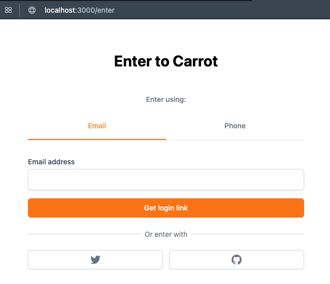

# carrot-market

# https://nomadcoders.co/carrot-market 강의에서 발췌 및 참고 하였습니다.

#3 SETUP

#3.0 NextJS Setup (06:23)
દ
### 설치
npx create-next-app@latest --typescript

### Git 추가
git remote add origin https:/github.com/sunjolee/carrot-market

### 실행
npm run dev


#3.1 TailwindCSS Setup (08:50)

### tailwind 설치
npm install -D tailwindcss postcss autoprefixer
npx tailwindcss init -p


  
```typescript
// globals.css
@tailwind base;
@tailwind components;
@tailwind utilities;

// tailwind.config.js
module.exports = {
    content: [
        "./pages/**/*.{js,jsx,ts,tsx}",
        "./components/**/*.{js,jsx,ts,tsx}",
    ],
    theme: {
        extend: {},
    },
    plugins: [],
};


// index.tsx
import type { NextPage } from "next";


const Home: NextPage = () => {
  return (
      <div className="bg-red-500">
        <h1 className="text-black">it works</h1>
      </div>
  );
};

export default Home;

```
#4 TOUR OF TAILWIND

#4.0 Introduction (11:40)

### www.tailwindcss.com

### Intellij 에서 tailwind css IntelliSense 적용
* https://plugins.jetbrains.com/plugin/15321-tailwind-css
* 나 같은 경우는 Intellij IDEA Ultimate 2022.1.3 버젼 업데이트 후
* plug in [Tailwind CSS] 설치 후 Intellij 재시작하였음
* 그럼 아래와 같이 IntelliSense 적용이 된다.

 

#4.1 Test Drive part One (15:01)


```typescript
// index.tsx
import type { NextPage } from "next";

const Home: NextPage = () => {
    return (
        <div className="bg-slate-400 py-20 px-10 grid gap-10">
            <div className="bg-white p-6 rounded-3xl shadow-xl">
                <span className="font-semibold text-3xl">Select Item</span>
                <div className="flex justify-between my-2">
                    <span className="text-gray-500">Grey Chair</span>
                    <span className="font-semibold">$19</span>
                </div>
                <div className="flex justify-between">
                    <span className="text-gray-500">Grey Chair</span>
                    <span className="font-semibold">$19</span>
                </div>
                <div className="flex justify-between mt-2 pt-2 border-t-2 border-dashed">
                    <span>Total</span>
                    <span className="font-semibold">$10</span>
                </div>
                <div
                    className="mt-5 bg-blue-500 text-white p-3
          text-center rounded-xl w-2/4 mx-auto
         "
                >
                    Checkout
                </div>
            </div>
            <div className="bg-white p-10 rounded-2xl shadow-xl"></div>
            <div className="bg-white p-10 rounded-2xl shadow-xl"></div>
            <div className="bg-white p-10 rounded-2xl shadow-xl"></div>
        </div>
    );
};

export default Home;

```

#4.2 Test Drive part Two (08:52)

* padding
  * p-10 : 사방으로 padding 10px 
  * pr-10 : padding-right
  * pl-10 : padding-left
  * pt-10 : padding-top
  * pb-10 : padding-bottom
  * px-10 : padding-left, right
  * py-10 : padding-top, bottom
  * 단위 ( 반응형은 rem 많이 사용 )
    * px : 픽셀값
    * % : 비율
    * em : ( 요즘 잘 사용 하지 않음 예전에 font 때문에 사용 ) - 자기와 가장 가까운 상위 기준 size에 배수로 계산
      * ´ font-size : 20px 
        * 1em : 20px
        * 1.5em : 30px
        * 2em : 40px
        * 0.3em : 6px
        * 0.75em : 15px -> 15px로 하고 싶을 때 0.75em을 구하는 방법은 15/20 = 0.75가 나온다.
    * rem :  ( 반응형 웹, 모바일 : root 기준 html 기준으로 em )
      @media all and (max-width:1000px){
        html { font-size: 10px }
      }
      * 사용처 : 100% rem만 사용하지는 않고 font size, padding 에서 주로 사용 
     
 
#4.3 Test Drive part Three (13:06)

#4.4 Modifiers (07:20)

#4.5 Transitions (09:59)

#4.6 Modifiers for Lists (07:00)

#4.7 Modifiers for Forms (18:38)

#4.8 More Modifiers (12:48)

#4.9 Responsive Modifiers (09:05)

#4.10 Responsive Modifiers part Two (09:10)

#4.11 Dark Mode (10:10)

#4.12 Just In Time Compiler (11:18)

# 4.13 Conclusions (01:09)
# 5 TAILWIND PRACTICE

# 5.0 Introduction (03:08)

# 5.1 Auth part One (11:49)

# 5.2 Auth part Two (13:29)

npm install @tailwindcss/forms

#5.3 Home Screen (10:20)

#5.4 Item Detail (12:02)

#5.5 Upload Item (11:27)

#5.6 Community (06:42)

#5.7 Community Detail (08:53)

#5.7 Write (02:35)

#5.8 Chats (05:02)

#5.9 Chat Detail (11:49)

#5.10 Profile (05:52)

#5.11 Bought, Loved and Sold (02:34)

#5.12 Edit Profile (06:55)

#5.13 Streams (05:42)

#5.14 Stream (04:31)

#5.15 Add Stream (03:59)

#5.16 Layout part One (10:34)

#5.17 Layout part Two (10:23)

#5.18 Conclusions (03:02)
#6 DATABASE SETUP

#6.0 Before We Start (06:29)

#6.1 What is Prisma (04:16)

# 6.2 Prisma Setup (08:53)

## Prisma 설치

npm install prisma -D

npx prisma init


# 6.3 What is PlanetScale (06:55)

https://app.planetscale.com/ 회원가입 ( git 계정으로 가입 )

# 6.4 Connecting to PlanetScale (09:19)

    mac
    
    `brew install planetscale/tap/pscale`
    
    `brew install mysql-client`
    
    `pscale auth login`
    
    `pscale region list`
    
    `pscale database create carrot-market --region ap-northeast`
    
    carrot-market: databse name
    
    ap-northeast: region list의 slug 사용
    
    admin pannel에서도 동일하게 생성이 가능
    
    보안 터널을 통해 PlanetScale과 컴퓨터를 연결할 수 있다
    
    `pscale connect carrot-market`
    
    pscale 에서 제공하는 URL을 데이터베이스에 연결
    
    `DATABASE_URL="mysql://127.0.0.1:3306/carrot-market"`

### 설치

* brew install planetscale/tap/pscale

* 에러 발생

* xcode 버젼 확인 ( /usr/bin/xcodebuild -version   ) xcode 12.5
)

* mac 소프트웨어 업데이트 도 안 되고 xcode 업데이트 명령어로도 안 되어서 아래 앱을 업데이트 중


* xcode 업데이트 완료


### 설치 명령어
# PlanetScale CLI

mac
    
    `brew install planetscale/tap/pscale`
    
    `brew install mysql-client`
    
    `pscale auth login`
    
    `pscale region list`
    
    `pscale database create carrot-market --region ap-northeast`
    
    carrot-market: databse name
    
    ap-northeast: region list의 slug 사용
    
    admin pannel에서도 동일하게 생성이 가능
    
    보안 터널을 통해 PlanetScale과 컴퓨터를 연결할 수 있다
    
    `pscale connect carrot-market`
    
    pscale 에서 제공하는 URL을 데이터베이스에 연결
    
    `DATABASE_URL="mysql://127.0.0.1:3306/carrot-market"`


    npx  prisma db push

    npx prisma studio

    npx prisma generate


#6.5 Push To PlanetScale (12:19)

* npx prisma db push

* push 성공


#6.6 Prisma Client (11:28)
* npx prisma studio : 데이터베이스 관리자 패널
* npm i @prisma/client

#6.7 API Routes (07:59)


# 6.8 Recap (05:30)
# 7 REACT HOOK FORM

# 7.0 Introduction (02:50)

# 7.1 Making Forms Alone (14:07)


* npm i react-hook-form
  

```typescript
import { useState } from "react";

export default function Forms() {
    const [username, setUsername] = useState("");
    const [email, setEmail] = useState("");
    const [password, setPassword] = useState("");
    const [formErrors, setFormErrors] = useState("");
    const [emailError, setEmailError] = useState("");
    const onUsernameChange = (event: React.SyntheticEvent<HTMLInputElement>) => {
        const {
            currentTarget: { value },
        } = event;
        setUsername(value);
    };
    const onEmailChange = (event: React.SyntheticEvent<HTMLInputElement>) => {
        const {
            currentTarget: { value },
        } = event;
        setEmailError("");
        setEmail(value);
    };
    const onPasswordChange = (event: React.SyntheticEvent<HTMLInputElement>) => {
        const {
            currentTarget: { value },
        } = event;
        setPassword(value);
    };
    const onSubmit = (event: React.SyntheticEvent<HTMLFormElement>) => {
        event.preventDefault();
        if (username === "" || email === "" || password === "") {
            setFormErrors("All fields are required");
        }
        if (!email.includes("@")) {
            setEmailError("email is required");
        }
    };
    return (
        <form onSubmit={onSubmit}>
            <input
                value={username}
                onChange={onUsernameChange}
                type="text"
                placeholder="Username"
                required
                minLength={5}
            />
            <input
                value={email}
                onChange={onEmailChange}
                type="email"
                placeholder="Email"
                required
            />
            {emailError}
            <input
                value={password}
                onChange={onPasswordChange}
                type="password"
                placeholder="Password"
                required
            />
            <input type="submit" value="Create Account" />
        </form>
    );
}
```

# 7.2 The Register Function (09:39)


* react-hook-form 을 사용하여 간단한 코드로 변경 함
```typescript
import { useState } from "react";
import { useForm } from "react-hook-form";
 
// Better validation
// Better Erros (set, clear, display)
// Have control over inputs
  
export default function Forms() {
    const { register, watch } = useForm();
    console.log(watch());
    return (
        <form>
            <input
                {...register("username")}
                type="text"
                placeholder="Username"
                required
                minLength={5}
            />
            <input {...register("email")} type="email" placeholder="Email" required />
            <input
                {...register("password")}
                type="password"
                placeholder="Password"
                required
            />
            <input type="submit" value="Create Account" />
        </form>
    );
}
```

#7.3 Validation (08:23)


```typescript
import { useState } from "react";
import { useForm } from "react-hook-form";

// Better validation
// Better Erros (set, clear, display)
// Have control over inputs

export default function Forms() {
  const { register, handleSubmit } = useForm();
  const onValid = () => {
    console.log("im valid bby");
  };
  return (
          <form onSubmit={handleSubmit(onValid)}>
                  <input
                          {...register("username", {
                              required: true,
                            })}
  type="text"
  placeholder="Username"
  minLength={5}
  />
  <input
  {...register("email", { required: true })}
  type="email"
  placeholder="Email"
          />
          <input
                  {...register("password", { required: true })}
  type="password"
  placeholder="Password"
  />
  <input type="submit" value="Create Account" />
          </form>
);
}
```


#7.4 Validation part Two (09:16)


```typescript
import { useState } from "react";
import { FieldErrors, useForm } from "react-hook-form";

// Better validation
// Better Erros (set, clear, display)
// Have control over inputs

interface LoginForm {
  username: string;
  password: string;
  email: string;
}

export default function Forms() {
  const { register, handleSubmit } = useForm<LoginForm>();
  const onValid = (data: LoginForm) => {
    console.log("im valid bby");
  };
  const onInvalid = (errors: FieldErrors) => {
    console.log(errors);
  };
  return (
          <form onSubmit={handleSubmit(onValid, onInvalid)}>
                  <input
                          {...register("username", {
                              required: "Username is required",
                              minLength: {
                                message: "The username should be longer than 5 chars.",
                                value: 5,
                              },
                            })}
  type="text"
  placeholder="Username"
          />
          <input
                  {...register("email", { required: "Email is required" })}
  type="email"
  placeholder="Email"
          />
          <input
                  {...register("password", { required: "Password is required" })}
  type="password"
  placeholder="Password"
  />
  <input type="submit" value="Create Account" />
          </form>
);
}
```

# 7.5 Errors (11:01)


```typescript
import { useState } from "react";
import { FieldErrors, useForm } from "react-hook-form";

// Better validation
// Better Erros (set, clear, display)
// Have control over inputs

interface LoginForm {
    username: string;
    password: string;
    email: string;
}

export default function Forms() {
    const { register, handleSubmit, formState: { errors },  } = useForm<LoginForm>({mode:"onBlur"});
    const onValid = (data: LoginForm) => {
        console.log("im valid bby");
    };
    const onInvalid = (errors: FieldErrors) => {
        console.log(errors);
    };
    console.log(errors);
    return (
        <form onSubmit={handleSubmit(onValid, onInvalid)}>
            <div className={"display:flex;"}>
                <div>
                    <input
                        {...register("username", {
                            required: "Username is required",
                            minLength: {
                                message: "The username should be longer than 5 chars.",
                                value: 5,
                            },
                        })}
                        type="text"
                        placeholder="Username"
                    />
                    <span className={"text-fuchsia-900"}>{errors.username?.message}</span>
                </div>
                <div>
                    <input
                        {...register("email", {
                            required: "Email is required",
                            validate: {
                                notGmail: (value) => !value.includes("@gmail.com") || "Gmail is not allowed",
                            }
                        })}
                        type="email"
                        placeholder="Email"
                    />
                    <span className={"text-fuchsia-900"}>{errors.email?.message}</span>
                </div>
                <div>
                    <input
                        {...register("password", { required: "Password is required" })}
                        type="password"
                        placeholder="Password"
                    />
                    <span className={"text-fuchsia-900"}>{errors.password?.message}</span>
                </div>
                <div>
                    <input type="submit" value="Create Account" />
                </div>
            </div>
        </form>
    );
}
```

# 7.6 Extras (07:27)


```typescript
import { useState } from "react";
import { FieldErrors, useForm } from "react-hook-form";

// Better validation
// Better Erros (set, clear, display)
// Have control over inputs

interface LoginForm {
    username: string;
    password: string;
    email: string;
    errors?: string;
}

export default function Forms() {
    const { register, handleSubmit, formState: { errors },
        watch,
        setError,
        setValue,
        reset,
        resetField,
    } = useForm<LoginForm>({mode:"onBlur"});
    const onValid = (data: LoginForm) => {
        console.log("im valid bby");
    };
    const onInvalid = (errors: FieldErrors) => {
        console.log(errors);
    };
    console.log(errors);
    return (
        <form onSubmit={handleSubmit(onValid, onInvalid)}>
            <div className={"display:flex;"}>
                <div>
                    <input
                        {...register("username", {
                            required: "Username is required",
                            minLength: {
                                message: "The username should be longer than 5 chars.",
                                value: 5,
                            },
                        })}
                        type="text"
                        placeholder="Username"
                    />
                    <span className={"text-fuchsia-900"}>{errors.username?.message}</span>
                </div>
                <div>
                    <input
                        {...register("email", {
                            required: "Email is required",
                            validate: {
                                notGmail: (value) => !value.includes("@gmail.com") || "Gmail is not allowed",
                            }
                        })}
                        type="email"
                        placeholder="Email"
                    />
                    <span className={"text-fuchsia-900"}>{errors.email?.message}</span>
                </div>
                <div>
                    <input
                        {...register("password", { required: "Password is required" })}
                        type="password"
                        placeholder="Password"
                    />
                    <span className={"text-fuchsia-900"}>{errors.password?.message}</span>
                </div>
                <div>
                    <input type="submit" value="Create Account" />
                </div>
            </div>
        </form>
    );
}
```


### https://react-hook-form.com/api/useform/formstate 사이트 참고하여 사용

# 8 REFACTORING

# 8.0 Enter Form (08:40)



```typescript
// enter.tsx
import type { NextPage } from "next";
import { useState } from "react";
import { useForm } from "react-hook-form";
import Button from "@components/button";
import Input from "@components/input";
import { cls } from "@libs/utils";

interface EnterForm {
    email?: string;
    phone?: string;
}

const Enter: NextPage = () => {
    const { register, handleSubmit, reset } = useForm<EnterForm>();
    const [method, setMethod] = useState<"email" | "phone">("email");
    const onEmailClick = () => {
        reset();
        setMethod("email");
    };
    const onPhoneClick = () => {
        reset();
        setMethod("phone");
    };
    const onValid = (data: EnterForm) => {
        console.log(data);
    };
    return (
        <div className="mt-16 px-4">
            <h3 className="text-3xl font-bold text-center">Enter to Carrot</h3>
            <div className="mt-12">
                <div className="flex flex-col items-center">
                    <h5 className="text-sm text-gray-500 font-medium">Enter using:</h5>
                    <div className="grid  border-b  w-full mt-8 grid-cols-2 ">
                        <button
                            className={cls(
                                "pb-4 font-medium text-sm border-b-2",
                                method === "email"
                                    ? " border-orange-500 text-orange-400"
                                    : "border-transparent hover:text-gray-400 text-gray-500"
                            )}
                            onClick={onEmailClick}
                        >
                            Email
                        </button>
                        <button
                            className={cls(
                                "pb-4 font-medium text-sm border-b-2",
                                method === "phone"
                                    ? " border-orange-500 text-orange-400"
                                    : "border-transparent hover:text-gray-400 text-gray-500"
                            )}
                            onClick={onPhoneClick}
                        >
                            Phone
                        </button>
                    </div>
                </div>
                <form
                    onSubmit={handleSubmit(onValid)}
                    className="flex flex-col mt-8 space-y-4"
                >
                    {method === "email" ? (
                        <Input
                            register={register("email", {
                                required: true,
                            })}
                            name="email"
                            label="Email address"
                            type="email"
                            required
                        />
                    ) : null}
                    {method === "phone" ? (
                        <Input
                            register={register("phone")}
                            name="phone"
                            label="Phone number"
                            type="number"
                            kind="phone"
                            required
                        />
                    ) : null}
                    {method === "email" ? <Button text={"Get login link"} /> : null}
                    {method === "phone" ? (
                        <Button text={"Get one-time password"} />
                    ) : null}
                </form>

                <div className="mt-8">
                    <div className="relative">
                        <div className="absolute w-full border-t border-gray-300" />
                        <div className="relative -top-3 text-center ">
              <span className="bg-white px-2 text-sm text-gray-500">
                Or enter with
              </span>
                        </div>
                    </div>
                    <div className="grid grid-cols-2 mt-2 gap-3">
                        <button className="flex justify-center items-center py-2 px-4 border border-gray-300 rounded-md shadow-sm bg-white text-sm font-medium text-gray-500 hover:bg-gray-50">
                            <svg
                                className="w-5 h-5"
                                aria-hidden="true"
                                fill="currentColor"
                                viewBox="0 0 20 20"
                            >
                                <path d="M6.29 18.251c7.547 0 11.675-6.253 11.675-11.675 0-.178 0-.355-.012-.53A8.348 8.348 0 0020 3.92a8.19 8.19 0 01-2.357.646 4.118 4.118 0 001.804-2.27 8.224 8.224 0 01-2.605.996 4.107 4.107 0 00-6.993 3.743 11.65 11.65 0 01-8.457-4.287 4.106 4.106 0 001.27 5.477A4.073 4.073 0 01.8 7.713v.052a4.105 4.105 0 003.292 4.022 4.095 4.095 0 01-1.853.07 4.108 4.108 0 003.834 2.85A8.233 8.233 0 010 16.407a11.616 11.616 0 006.29 1.84" />
                            </svg>
                        </button>
                        <button className="flex justify-center items-center py-2 px-4 border border-gray-300 rounded-md shadow-sm bg-white text-sm font-medium text-gray-500 hover:bg-gray-50">
                            <svg
                                className="w-5 h-5"
                                aria-hidden="true"
                                fill="currentColor"
                                viewBox="0 0 20 20"
                            >
                                <path
                                    fillRule="evenodd"
                                    d="M10 0C4.477 0 0 4.484 0 10.017c0 4.425 2.865 8.18 6.839 9.504.5.092.682-.217.682-.483 0-.237-.008-.868-.013-1.703-2.782.605-3.369-1.343-3.369-1.343-.454-1.158-1.11-1.466-1.11-1.466-.908-.62.069-.608.069-.608 1.003.07 1.531 1.032 1.531 1.032.892 1.53 2.341 1.088 2.91.832.092-.647.35-1.088.636-1.338-2.22-.253-4.555-1.113-4.555-4.951 0-1.093.39-1.988 1.029-2.688-.103-.253-.446-1.272.098-2.65 0 0 .84-.27 2.75 1.026A9.564 9.564 0 0110 4.844c.85.004 1.705.115 2.504.337 1.909-1.296 2.747-1.027 2.747-1.027.546 1.379.203 2.398.1 2.651.64.7 1.028 1.595 1.028 2.688 0 3.848-2.339 4.695-4.566 4.942.359.31.678.921.678 1.856 0 1.338-.012 2.419-.012 2.747 0 .268.18.58.688.482A10.019 10.019 0 0020 10.017C20 4.484 15.522 0 10 0z"
                                    clipRule="evenodd"
                                />
                            </svg>
                        </button>
                    </div>
                </div>
            </div>
        </div>
    );
};
export default Enter;

// input.tsx
  import type { UseFormRegisterReturn } from "react-hook-form";

  interface InputProps {
    label: string;
    name: string;
    kind?: "text" | "phone" | "price";
    type: string;
    register: UseFormRegisterReturn;
    required: boolean;
  }

  export default function Input({
                                  label,
                                  name,
                                  kind = "text",
                                  register,
                                  type,
                                  required,
                                }: InputProps) {
    return (
            <div>
                    <label
                            className="mb-1 block text-sm font-medium text-gray-700"
    htmlFor={name}
            >
            {label}
            </label>
    {kind === "text" ? (
                    <div className="rounded-md relative flex  items-center shadow-sm">
                    <input
                            id={name}
            required={required}
      {...register}
      type={type}
      className="appearance-none w-full px-3 py-2 border border-gray-300 rounded-md shadow-sm placeholder-gray-400 focus:outline-none focus:ring-orange-500 focus:border-orange-500"
              />
              </div>
    ) : null}
    {kind === "price" ? (
                    <div className="rounded-md relative flex  items-center shadow-sm">
                    <div className="absolute left-0 pointer-events-none pl-3 flex items-center justify-center">
                    <span className="text-gray-500 text-sm">$</span>
                            </div>
                            <input
            id={name}
      required={required}
      {...register}
      type={type}
      className="appearance-none pl-7 w-full px-3 py-2 border border-gray-300 rounded-md shadow-sm placeholder-gray-400 focus:outline-none focus:ring-orange-500 focus:border-orange-500"
      />
      <div className="absolute right-0 pointer-events-none pr-3 flex items-center">
      <span className="text-gray-500">KRW</span>
              </div>
              </div>
    ) : null}
    {kind === "phone" ? (
                    <div className="flex rounded-md shadow-sm">
                    <span className="flex items-center justify-center px-3 rounded-l-md border border-r-0 border-gray-300 bg-gray-50 text-gray-500 select-none text-sm">
                            +82
                            </span>
                            <input
            id={name}
      required={required}
      {...register}
      type={type}
      className="appearance-none w-full px-3 py-2 border border-gray-300 rounded-md rounded-l-none shadow-sm placeholder-gray-400 focus:outline-none focus:ring-orange-500 focus:border-orange-500"
              />
              </div>
    ) : null}
    </div>
  );
  }


```

# 8.1 Form Submission (08:24)


```typescript
// api/users/enter.tsx
import { NextApiRequest, NextApiResponse } from "next";
import client from "@libs/client";

export default async function handler(
        req: NextApiRequest,
        res: NextApiResponse
) {
  if (req.method !== "POST") {
    res.status(401).end();
  }
  console.log(req.body.email);
  console.log(req.body.phone);
  res.status(200).end();
}


// enter.tsx
import type { NextPage } from "next";
import { useState } from "react";
import { useForm } from "react-hook-form";
import Button from "@components/button";
import Input from "@components/input";
import { cls } from "@libs/utils";

interface EnterForm {
  email?: string;
  phone?: string;
}

const Enter: NextPage = () => {
  const [submitting, setSubmitting] = useState(false);
  const { register, handleSubmit, reset } = useForm<EnterForm>();
  const [method, setMethod] = useState<"email" | "phone">("email");
  const onEmailClick = () => {
    reset();
    setMethod("email");
  };
  const onPhoneClick = () => {
    reset();
    setMethod("phone");
  };
  const onValid = (data: EnterForm) => {
    setSubmitting(true);
    fetch("/api/users/enter", {
      method: "POST",
      body: JSON.stringify(data),
      headers: {
        "Content-Type": "application/json",
      },
    }).then(() => {
      setSubmitting(false);
    })
  };
  return (
          <div className="mt-16 px-4">
          <h3 className="text-3xl font-bold text-center">Enter to Carrot</h3>
  <div className="mt-12">
  <div className="flex flex-col items-center">
  <h5 className="text-sm text-gray-500 font-medium">Enter using:</h5>
  <div className="grid border-b  w-full mt-8 grid-cols-2 ">
  <button
          className={cls(
    "pb-4 font-medium text-sm border-b-2",
    method === "email"
          ? " border-orange-500 text-orange-400"
          : "border-transparent hover:text-gray-400 text-gray-500"
)}
  onClick={onEmailClick}
          >
          Email
          </button>
          <button
  className={cls(
    "pb-4 font-medium text-sm border-b-2",
    method === "phone"
          ? " border-orange-500 text-orange-400"
          : "border-transparent hover:text-gray-400 text-gray-500"
)}
  onClick={onPhoneClick}
          >
          Phone
          </button>
          </div>
          </div>
          <form
  onSubmit={handleSubmit(onValid)}
  className="flex flex-col mt-8 space-y-4"
  >
  {method === "email" ? (
          <Input
                  register={register("email", {
    required: true,
  })}
  name="email"
  label="Email address"
  type="email"
  required
  />
) : null}
  {method === "phone" ? (
          <Input
                  register={register("phone")}
    name="phone"
    label="Phone number"
    type="number"
    kind="phone"
    required
    />
  ) : null}
  {method === "email" ? <Button text={"Get login link"} /> : null}
    {method === "phone" ? (
            <Button text={submitting ? "Loading" : "Get one-time password"} />
    ) : null}
    </form>

    <div className="mt-8">
  <div className="relative">
  <div className="absolute w-full border-t border-gray-300" />
  <div className="relative -top-3 text-center ">
  <span className="bg-white px-2 text-sm text-gray-500">
          Or enter with
  </span>
  </div>
  </div>
  <div className="grid grid-cols-2 mt-2 gap-3">
    <button className="flex justify-center items-center py-2 px-4 border border-gray-300 rounded-md shadow-sm bg-white text-sm font-medium text-gray-500 hover:bg-gray-50">
    <svg
            className="w-5 h-5"
    aria-hidden="true"
    fill="currentColor"
    viewBox="0 0 20 20"
    >
    <path d="M6.29 18.251c7.547 0 11.675-6.253 11.675-11.675 0-.178 0-.355-.012-.53A8.348 8.348 0 0020 3.92a8.19 8.19 0 01-2.357.646 4.118 4.118 0 001.804-2.27 8.224 8.224 0 01-2.605.996 4.107 4.107 0 00-6.993 3.743 11.65 11.65 0 01-8.457-4.287 4.106 4.106 0 001.27 5.477A4.073 4.073 0 01.8 7.713v.052a4.105 4.105 0 003.292 4.022 4.095 4.095 0 01-1.853.07 4.108 4.108 0 003.834 2.85A8.233 8.233 0 010 16.407a11.616 11.616 0 006.29 1.84" />
            </svg>
            </button>
            <button className="flex justify-center items-center py-2 px-4 border border-gray-300 rounded-md shadow-sm bg-white text-sm font-medium text-gray-500 hover:bg-gray-50">
  <svg
          className="w-5 h-5"
    aria-hidden="true"
    fill="currentColor"
    viewBox="0 0 20 20"
    >
    <path
            fillRule="evenodd"
    d="M10 0C4.477 0 0 4.484 0 10.017c0 4.425 2.865 8.18 6.839 9.504.5.092.682-.217.682-.483 0-.237-.008-.868-.013-1.703-2.782.605-3.369-1.343-3.369-1.343-.454-1.158-1.11-1.466-1.11-1.466-.908-.62.069-.608.069-.608 1.003.07 1.531 1.032 1.531 1.032.892 1.53 2.341 1.088 2.91.832.092-.647.35-1.088.636-1.338-2.22-.253-4.555-1.113-4.555-4.951 0-1.093.39-1.988 1.029-2.688-.103-.253-.446-1.272.098-2.65 0 0 .84-.27 2.75 1.026A9.564 9.564 0 0110 4.844c.85.004 1.705.115 2.504.337 1.909-1.296 2.747-1.027 2.747-1.027.546 1.379.203 2.398.1 2.651.64.7 1.028 1.595 1.028 2.688 0 3.848-2.339 4.695-4.566 4.942.359.31.678.921.678 1.856 0 1.338-.012 2.419-.012 2.747 0 .268.18.58.688.482A10.019 10.019 0 0020 10.017C20 4.484 15.522 0 10 0z"
    clipRule="evenodd"
            />
            </svg>
            </button>
            </div>
            </div>
            </div>
            </div>
  );
  };
  export default Enter;

```

# 8.2 Clean Code part One (08:49)
# 8.3 Clean Code part Two (07:31)


```typescript
// useMutation.tsx
import { useState } from "react";

interface UseMutationState {
  loading: boolean;
  data?: object;
  error?: object;
}
type UseMutationResult = [(data: any) => void, UseMutationState];

export default function useMutation(url: string): UseMutationResult {
  const [state, setSate] = useState<UseMutationState>({
    loading: false,
    data: undefined,
    error: undefined,
  });
  function mutation(data: any) {
    setSate((prev) => ({ ...prev, loading: true }));
    fetch(url, {
      method: "POST",
      headers: {
        "Content-Type": "application/json",
      },
      body: JSON.stringify(data),
    })
            .then((response) => response.json().catch(() => {}))
            .then((data) => setSate((prev) => ({ ...prev, data })))
            .catch((error) => setSate((prev) => ({ ...prev, error })))
            .finally(() => setSate((prev) => ({ ...prev, loading: false })));
  }
  return [mutation, { ...state }];
}


// enter.tsx

import type { NextPage } from "next";
import { useState } from "react";
import { useForm } from "react-hook-form";
import Button from "@components/button";
import Input from "@components/input";
import useMutation from "@libs/client/useMutation";
import { cls } from "@libs/client/utils";

interface EnterForm {
  email?: string;
  phone?: string;
}

const Enter: NextPage = () => {
  const [enter, { loading, data, error }] = useMutation("/api/users/enter");
  const { register, handleSubmit, reset } = useForm<EnterForm>();
  const [method, setMethod] = useState<"email" | "phone">("email");
  const onEmailClick = () => {
    reset();
    setMethod("email");
  };
  const onPhoneClick = () => {
    reset();
    setMethod("phone");
  };
  const onValid = (validForm: EnterForm) => {
    if (loading) return;
    enter(validForm);
  };
  return (
          ...


```
# 8.4 withHandler (12:58)

```typescript
// withHandler.ts
import { NextApiRequest, NextApiResponse } from "next";

export default function withHandler(
        method: "GET" | "POST" | "DELETE",
        fn: (req: NextApiRequest, res: NextApiResponse) => void
) {
  return async function (req: NextApiRequest, res: NextApiResponse) {
    if (req.method !== method) {
      return res.status(405).end();
    }
    try {
      await fn(req, res);
    } catch (error) {
      console.log(error);
      return res.status(500).json({ error });
    }
  };
}

// enter.tsx
import { NextApiRequest, NextApiResponse } from "next";
import client from "@libs/server/client";
import withHandler from "@libs/server/withHandler";

async function handler(req: NextApiRequest, res: NextApiResponse) {
  console.log(req.body);
  return res.status(200).end();
}

export default withHandler("POST", handler);

```

# 8.5 Paths (05:06)

## 경로 설정 (../../libs) --> @libs 로 변경


```typescript
// tsconfig.json
{
  "compilerOptions": {
  "target": "es5",
          "lib": ["dom", "dom.iterable", "esnext"],
          "allowJs": true,
          "skipLibCheck": true,
          "strict": true,
          "forceConsistentCasingInFileNames": true,
          "noEmit": true,
          "esModuleInterop": true,
          "module": "esnext",
          "moduleResolution": "node",
          "resolveJsonModule": true,
          "isolatedModules": true,
          "jsx": "preserve",
          "incremental": true,
          "baseUrl": ".",
          "paths": {
            "@libs/*": ["libs/*"],
            "@components/*": ["components/*"]
  }
},
  "include": ["next-env.d.ts", "**/*.ts", "**/*.tsx"],
        "exclude": ["node_modules"]
}


```


# 9 AUTHENTICATION

# 9.0 Introduction (04:40)

#9.1 Accounts Logic (14:35)

* User 신규로 생성하는 방법 (api)

```typescript
// pages/api/users/enter.tsx
    const { phone, email } = req.body;
    const payload = phone ? { phone: +phone } : { email };

    const user = await client.user.upsert({
        where: {
            ...payload,
        },
        create: {
            name: "Anonymous",
            ...payload,
        },
        update: {},
    });
    console.log(user);
    return res.status(200).end();
    
```

# 9.2 Token Logic (15:01)

* token 모델 정보 추가

```typescript
model User {
  id        Int      @id @default(autoincrement())
  phone     Int?     @unique
  email     String?  @unique
  name      String
  avatar    String?
  createdAt DateTime @default(now())
  updatedAt DateTime @updatedAt
  tokens    Token[]
}

model Token {
  id        Int      @id @default(autoincrement())
  payload   String   @unique
  user      User     @relation(fields: [userId], references: [id])
  userId    Int      
  createdAt DateTime @default(now())
  updatedAt DateTime @updatedAt
}

```
* prisma 에 변경된 모델 정보 push

  npx  prisma db push

  

* push 된 테이블 정보 확인

  https://app.planetscale.com/sunjosj/carrot-market/main/schema

  

* prisma studio를 통해 테이블 정보 확인

  npx prisma studio

* client에서 추가된 테이블이 연결이 안 되는 경우 아래와 같이 사용 하면 됨
  
  npx prisma generate
  
  

```typescript
const { PrismaClient } = require('@prisma/client');
const client = new PrismaClient() ;
const token = await client.token.create({
```

  * connectOrCreate란?
    - 관련 레코드(데이터)가 존재하거나 존재하지 않거나 유무를 판단하여 존재 하지 않다면 해당 데이터를 삽입하는 것입니다.
    ```typescript
    import { NextApiRequest, NextApiResponse } from "next";
    import withHandler from "@libs/server/withHandler";
    const { PrismaClient } = require('@prisma/client')
    
    async function handler(req: NextApiRequest, res: NextApiResponse) {
    const { phone, email } = req.body;
    const user = phone ? { phone: +phone } : { email };
    const payload = Math.floor(100000 + Math.random() * 900000) + "";
    const client = new PrismaClient() ;
    const token = await client.token.create({
    data: {
    payload,
    user: {
    connectOrCreate: {
    where: {
    ...user,
    },
    create: {
    name: "Anonymous",
    ...user,
    },
    },
    },
    },
    });
    console.log(token);
```
 
  