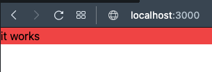

# carrot-market

---

### 0 pscale 로그인
pscale auth login

### 1. db 접속
pscale connect carrot-market ( master(main) 브랜치 )
pscale connect carrot-market indexes ( indexes 브랜치에 접속 )

### 2. 사이트 재실행 - 가장 최신 버젼의 클라이언트를 실행 한다.
npm run dev

### 3. DB 관리자 접속
npx prisma studio

---

### 모델 변경 정보 DB에 반영 ( 반영 후 클라이언트는 변경 정보가 안 따라주는데....결국 intellij를 다시 시작 하면 됨)
npx prisma db push

### 1.0 왜? 소스에서 추가 된 모델 정보가 자동으로 안 보이지??
### 1.1 그냥 인텔리 제이를 다시 열자... 다른 방법이 있나? 

## (혹시 안되면 ? 다시 ) 변경 된 DB 정보 client에 제너레이팅
npx prisma generate

  
    `brew install planetscale/tap/pscale`
    
    `brew install mysql-client`
    
    `pscale auth login`
    
    `pscale region list`
    
    `pscale database create carrot-market --region ap-northeast`
    
    carrot-market: databse name
    
    ap-northeast: region list의 slug 사용
    
    admin pannel에서도 동일하게 생성이 가능
    
    보안 터널을 통해 PlanetScale과 컴퓨터를 연결할 수 있다
    
    `pscale connect carrot-market`
    
    pscale 에서 제공하는 URL을 데이터베이스에 연결
    
    `DATABASE_URL="mysql://127.0.0.1:3306/carrot-market"`

# https://nomadcoders.co/carrot-market 강의에서 발췌 및 참고 하였습니다.

#3 SETUP

#3.0 NextJS Setup (06:23)
દ
### 설치
npx create-next-app@latest --typescript

### Git 추가
git remote add origin https:/github.com/sunjolee/carrot-market

### 실행
npm run dev

#3.1 TailwindCSS Setup (08:50)

### tailwind 설치
npm install -D tailwindcss postcss autoprefixer
npx tailwindcss init -p

   
#4 TOUR OF TAILWIND

#4.0 Introduction (11:40)

### www.tailwindcss.com

### Intellij 에서 tailwind css IntelliSense 적용
* https://plugins.jetbrains.com/plugin/15321-tailwind-css
* 나 같은 경우는 Intellij IDEA Ultimate 2022.1.3 버젼 업데이트 후
* plug in [Tailwind CSS] 설치 후 Intellij 재시작하였음
* 그럼 아래와 같이 IntelliSense 적용이 된다.

 

#4.1 Test Drive part One (15:01)

  
#4.2 Test Drive part Two (08:52)

* padding
  * p-10 : 사방으로 padding 10px 
  * pr-10 : padding-right
  * pl-10 : padding-left
  * pt-10 : padding-top
  * pb-10 : padding-bottom
  * px-10 : padding-left, right
  * py-10 : padding-top, bottom
  * 단위 ( 반응형은 rem 많이 사용 )
    * px : 픽셀값
    * % : 비율
    * em : ( 요즘 잘 사용 하지 않음 예전에 font 때문에 사용 ) - 자기와 가장 가까운 상위 기준 size에 배수로 계산
      * ´ font-size : 20px 
        * 1em : 20px
        * 1.5em : 30px
        * 2em : 40px
        * 0.3em : 6px
        * 0.75em : 15px -> 15px로 하고 싶을 때 0.75em을 구하는 방법은 15/20 = 0.75가 나온다.
    * rem :  ( 반응형 웹, 모바일 : root 기준 html 기준으로 em )
      @media all and (max-width:1000px){
        html { font-size: 10px }
      }
      * 사용처 : 100% rem만 사용하지는 않고 font size, padding 에서 주로 사용 
     
 
#4.3 Test Drive part Three (13:06)

#4.4 Modifiers (07:20)

#4.5 Transitions (09:59)

#4.6 Modifiers for Lists (07:00)

#4.7 Modifiers for Forms (18:38)

#4.8 More Modifiers (12:48)

#4.9 Responsive Modifiers (09:05)

#4.10 Responsive Modifiers part Two (09:10)

#4.11 Dark Mode (10:10)

#4.12 Just In Time Compiler (11:18)

# 4.13 Conclusions (01:09)
# 5 TAILWIND PRACTICE

# 5.0 Introduction (03:08)

# 5.1 Auth part One (11:49)

# 5.2 Auth part Two (13:29)

npm install @tailwindcss/forms

#5.3 Home Screen (10:20)

#5.4 Item Detail (12:02)

#5.5 Upload Item (11:27)

#5.6 Community (06:42)

#5.7 Community Detail (08:53)

#5.7 Write (02:35)

#5.8 Chats (05:02)

#5.9 Chat Detail (11:49)

#5.10 Profile (05:52)

#5.11 Bought, Loved and Sold (02:34)

#5.12 Edit Profile (06:55)

#5.13 Streams (05:42)

#5.14 Stream (04:31)

#5.15 Add Stream (03:59)

#5.16 Layout part One (10:34)

#5.17 Layout part Two (10:23)

#5.18 Conclusions (03:02)
#6 DATABASE SETUP

#6.0 Before We Start (06:29)

#6.1 What is Prisma (04:16)

# 6.2 Prisma Setup (08:53)

## Prisma 설치

npm install prisma -D

npx prisma init

# 6.3 What is PlanetScale (06:55)

https://app.planetscale.com/ 회원가입 ( git 계정으로 가입 )

# 6.4 Connecting to PlanetScale (09:19)

    mac
    
    `brew install planetscale/tap/pscale`
    
    `brew install mysql-client`
    
    `pscale auth login`
    
    `pscale region list`
    
    `pscale database create carrot-market --region ap-northeast`
    
    carrot-market: databse name
    
    ap-northeast: region list의 slug 사용
    
    admin pannel에서도 동일하게 생성이 가능
    
    보안 터널을 통해 PlanetScale과 컴퓨터를 연결할 수 있다
    
    `pscale connect carrot-market`
    
    pscale 에서 제공하는 URL을 데이터베이스에 연결
    
    `DATABASE_URL="mysql://127.0.0.1:3306/carrot-market"`

### 설치

* brew install planetscale/tap/pscale

* 에러 발생

* xcode 버젼 확인 ( /usr/bin/xcodebuild -version   ) xcode 12.5
)

* mac 소프트웨어 업데이트 도 안 되고 xcode 업데이트 명령어로도 안 되어서 아래 앱을 업데이트 중

* xcode 업데이트 완료

### 설치 명령어
# PlanetScale CLI

mac
    
    `brew install planetscale/tap/pscale`
    
    `brew install mysql-client`
    
    `pscale auth login`
    
    `pscale region list`
    
    `pscale database create carrot-market --region ap-northeast`
    
    carrot-market: databse name
    
    ap-northeast: region list의 slug 사용
    
    admin pannel에서도 동일하게 생성이 가능
    
    보안 터널을 통해 PlanetScale과 컴퓨터를 연결할 수 있다
    
    `pscale connect carrot-market`
    
    pscale 에서 제공하는 URL을 데이터베이스에 연결
    
    `DATABASE_URL="mysql://127.0.0.1:3306/carrot-market"`

    npx  prisma db push

    npx prisma studio

    npx prisma generate

#6.5 Push To PlanetScale (12:19)

* npx prisma db push

* push 성공

#6.6 Prisma Client (11:28)
* npx prisma studio : 데이터베이스 관리자 패널
* npm i @prisma/client

#6.7 API Routes (07:59)

# 6.8 Recap (05:30)
# 7 REACT HOOK FORM

# 7.0 Introduction (02:50)

# 7.1 Making Forms Alone (14:07)

* npm i react-hook-form
  
 
# 7.2 The Register Function (09:39)

* react-hook-form 을 사용하여 간단한 코드로 변경 함
 
#7.3 Validation (08:23)

 

#7.4 Validation part Two (09:16)

 
# 7.5 Errors (11:01)

 
# 7.6 Extras (07:27)

 

### https://react-hook-form.com/api/useform/formstate 사이트 참고하여 사용

# 8 REFACTORING

# 8.0 Enter Form (08:40)

 
# 8.1 Form Submission (08:24)

 
# 8.2 Clean Code part One (08:49)
# 8.3 Clean Code part Two (07:31)

 
# 8.4 withHandler (12:58)
 
# 8.5 Paths (05:06)

## 경로 설정 (../../libs) --> @libs 로 변경
 

# 9 AUTHENTICATION

# 9.0 Introduction (04:40)

#9.1 Accounts Logic (14:35)

* User 신규로 생성하는 방법 (api)
 
# 9.2 Token Logic (15:01)

* token 모델 정보 추가
 
* prisma 에 변경된 모델 정보 push

  npx  prisma db push

  

* push 된 테이블 정보 확인

  https://app.planetscale.com/sunjosj/carrot-market/main/schema

  

* prisma studio를 통해 테이블 정보 확인

  npx prisma studio

* client에서 추가된 테이블이 연결이 안 되는 경우 아래와 같이 사용 하면 됨
  
  npx prisma generate
  
  
 
  * connectOrCreate란?
    - 관련 레코드(데이터)가 존재하거나 존재하지 않거나 유무를 판단하여 존재 하지 않다면 해당 데이터를 삽입하는 것입니다.
    
 
  