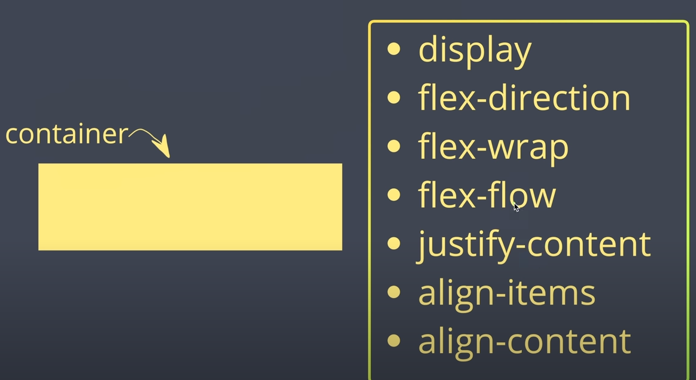
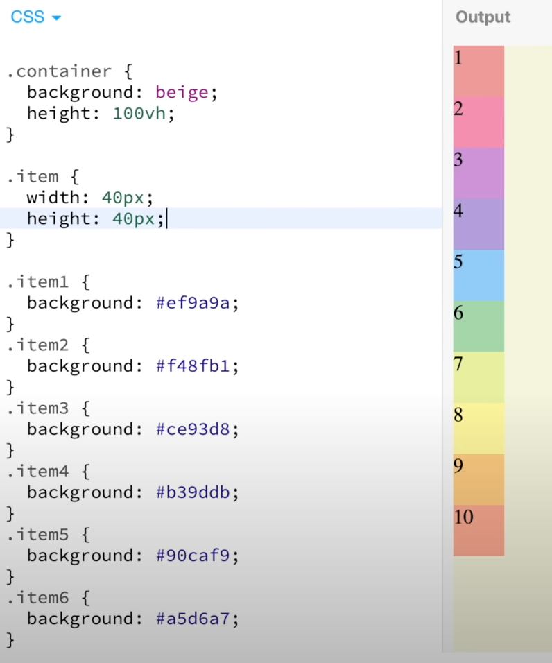
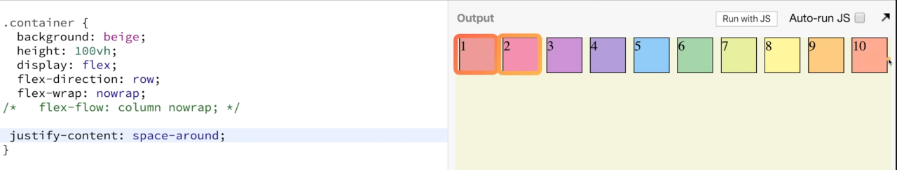
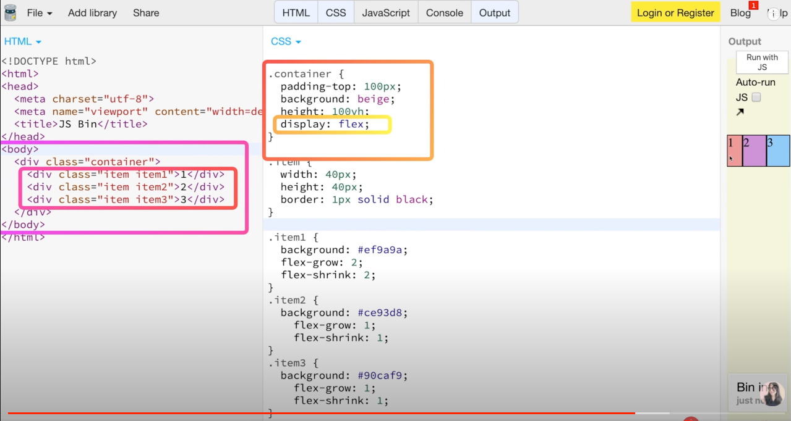

https://www.youtube.com/watch?v=7neASrWEFEM 강의 참고

# float

# container 속성 값 들

# item 속성 값 들

# div 자동 생성
div.container>div.item.item${$}*10 입력하고 탭키를 누르면 아래와 같이 자동 생성

            

                
1

                
2

                
3

                
4

                
5

                
6

                
7

                
8

                
9

                
10

            

# color 지정 사이트
https://www.material.io/design/color/the-color-system.html#tools-for-picking-colors

# container
### 기본

### display : flex ( 왼쪽 -> 오른쪽 )

display : flex ( 왼쪽 -> 오른쪽 ) 

### flex-direction: row; 기본 ( 왼쪽에서 오른쪽 )

display : flex ( 왼쪽 -> 오른쪽 ) 

### flex-direction: row-reverse; 오른쪽에서 왼쪽

display : flex ( 왼쪽 -> 오른쪽 ) 

### flex-direction: column 위에서 아래로

display : flex ( 왼쪽 -> 오른쪽 )

### flex-direction: column-reverse; 아래에서 위로

display : flex ( 왼쪽 -> 오른쪽 )

flex-direction: row; 기본 ( 왼쪽에서 오른쪽 )

### flex-wrap: nowrap; (item들이 아무리 많아도 한줄에 빼곡히 표시 된다.)

display : flex ( 왼쪽 -> 오른쪽 )

flex-direction: row; 기본 ( 왼쪽에서 오른쪽 )

### flex-wrap: wrap; (item들이 화면 크기에 꽉 차게 되면 다음 라인으로 넘어 간다.)

display : flex ( 왼쪽 -> 오른쪽 )

flex-direction: row; 기본 ( 왼쪽에서 오른쪽 )

### flex-wrap: wrap-reverse; 거꾸로 표시

display : flex ( 왼쪽 -> 오른쪽 )

flex-direction: row; 기본 ( 왼쪽에서 오른쪽 )

flex-wrap: nowrap; (item들이 아무리 많아도 한줄에 빼곡히 표시 된다.)

### flex-flow: column nowrap; 한꺼번에 지정 가능

display : flex ( 왼쪽 -> 오른쪽 )

flex-direction: row; 기본 ( 왼쪽에서 오른쪽 )

flex-wrap: nowrap; (item들이 아무리 많아도 한줄에 빼곡히 표시 된다.)

### justify-content: flex-start; 기본 ( item들 정렬 왼쪽에서 오른쪽으로 )

display : flex ( 왼쪽 -> 오른쪽 )

flex-direction: row; 기본 ( 왼쪽에서 오른쪽 )

flex-wrap: nowrap; (item들이 아무리 많아도 한줄에 빼곡히 표시 된다.)

### justify-content: flex-end; 기본 ( item들 정렬 오른쪽에서 왼쪽으로 item 순서는 그대로 )

display : flex ( 왼쪽 -> 오른쪽 )

### flex-direction: column 위에서 아래로

flex-wrap: nowrap; (item들이 아무리 많아도 한줄에 빼곡히 표시 된다.)

### justify-content: flex-end; 기본 ( item들 정렬 위에서 아래로 item 순서는 그대로 )

display : flex ( 왼쪽 -> 오른쪽 )

flex-direction: row; 기본 ( 왼쪽에서 오른쪽 )

flex-wrap: nowrap; (item들이 아무리 많아도 한줄에 빼곡히 표시 된다.)

### justify-content: center; ( item들 정렬이 가운데로 )

display : flex ( 왼쪽 -> 오른쪽 )

flex-direction: row; 기본 ( 왼쪽에서 오른쪽 )

flex-wrap: nowrap; (item들이 아무리 많아도 한줄에 빼곡히 표시 된다.)

### justify-content: space-around; ( item의 box 간격이 생김 : 가장 왼쪽 오른쪽은 얇다)

display : flex ( 왼쪽 -> 오른쪽 )

flex-direction: row; 기본 ( 왼쪽에서 오른쪽 )

flex-wrap: nowrap; (item들이 아무리 많아도 한줄에 빼곡히 표시 된다.)

### justify-content: space-evenly; ( item의 box 간격이 똑 같이)

display : flex ( 왼쪽 -> 오른쪽 )

flex-direction: row; 기본 ( 왼쪽에서 오른쪽 )

flex-wrap: nowrap; (item들이 아무리 많아도 한줄에 빼곡히 표시 된다.)

### justify-content: space-between; ( item의 가장 왼쪽 오른쪽만 맞춰주고 나머지는 화면 중간으로 맞춰줌)

display : flex ( 왼쪽 -> 오른쪽 )

flex-direction: row; 기본 ( 왼쪽에서 오른쪽 )

flex-wrap: nowrap; (item들이 아무리 많아도 한줄에 빼곡히 표시 된다.)

justify-content: space-between; ( item의 가장 왼쪽 오른쪽만 맞춰주고 나머지는 화면 중간으로 맞춰줌)  -->중심측 기준

### align-items: center; ( item들을 수직적으로 중심에 놓는다 ) --> 중심측 반대편 기준

display : flex ( 왼쪽 -> 오른쪽 )

flex-direction: row; 기본 ( 왼쪽에서 오른쪽 )

flex-wrap: nowrap; (item들이 아무리 많아도 한줄에 빼곡히 표시 된다.)

justify-content: space-between; ( item의 가장 왼쪽 오른쪽만 맞춰주고 나머지는 화면 중간으로 맞춰줌)  -->중심측 기준

### align-items: baseline; ( 1번의 text 문자 위치 기준으로 정렬 )

display : flex ( 왼쪽 -> 오른쪽 )

flex-direction: row; 기본 ( 왼쪽에서 오른쪽 )

flex-wrap: nowrap; (item들이 아무리 많아도 한줄에 빼곡히 표시 된다.)

justify-content: space-between; ( item의 가장 왼쪽 오른쪽만 맞춰주고 나머지는 화면 중간으로 맞춰줌)  -->중심측 기준

align-items: baseline; ( 1번의 text 문자 위치 기준으로 정렬 )

### align-content: space-between; ( item의 가장 위 아래쪽만 맞춰주고 나머지는 화면 중간으로 맞춰줌)

display : flex ( 왼쪽 -> 오른쪽 )

flex-direction: row; 기본 ( 왼쪽에서 오른쪽 )

flex-wrap: nowrap; (item들이 아무리 많아도 한줄에 빼곡히 표시 된다.)

justify-content: space-between; ( item의 가장 왼쪽 오른쪽만 맞춰주고 나머지는 화면 중간으로 맞춰줌)  -->중심측 기준

align-items: baseline; ( 1번의 text 문자 위치 기준으로 정렬 )

### align-content: center; ( item들이 가운데 위치 )

## 브라우저별 지원 다름 ( 확인 필요 )

---

# item 속성

## order 지정

## flex-grow ( 선택한 것만 너비를 늘렸을 때 늘어 남 )
* 1번만 늘어 남

* 1번이 2,3번에 비해 2배로 늘어 남

## flex-shrink ( 선택한 것만 너비를 줄였을 때 늘어 남 )

## flex-basis (item들이 너비를 비율로 설정)

## align-self ( item1 만 정렬 할 수 있다. )

